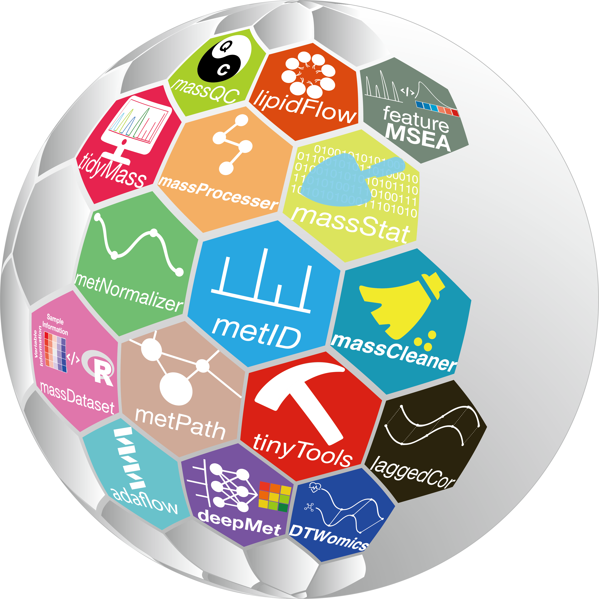
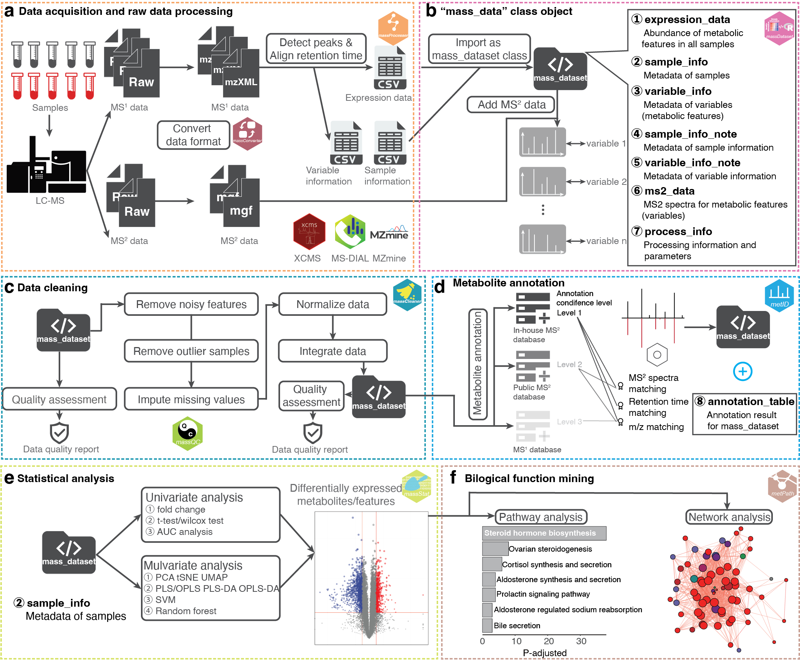

Here, you can learn how to use `tidyMass` to do the data processing and analysis for the metabolomics data. It contains several parts.

# If you are new to R or the tidyverse

We recommend that you start by learning some basics about R and the [tidyverse](https://www.tidyverse.org/) first, then return here when you feel ready. Here are some resources to start learning:

* [Finding Your Way To R](https://education.rstudio.com/learn/), from the RStudio Education team.

* [Learn the tidyverse](https://www.tidyverse.org/learn/), from the tidyverse team.

# Part 1. Install `tidymass`

You can learn how to install `tidymass`, and update it. You can also find here how to download the docker version of `tidymass` and build your own docker image based on `tidymass`.



# Part 2. massDatabase package and `mass_dataset`

You can find here how to download the demo data and create `mass_dataset` class by yourself. And how to use `mass_dataset` class organize your omics data and process it.



# Part 3. Metabolite annotation

All the metabolite annotation can be found here. You can also learn here how to construct the databases for `metid` using the `massdatabase` package.



# Part 4. Whole workflow using `tidymass`

Here, you can learn how to use `tidymass` for data processing and analysis, from data converting to biological function mining. 

The code, data and docker image of case study in [our manuscript](https://pubmed.ncbi.nlm.nih.gov/35902589/) are provided here.


