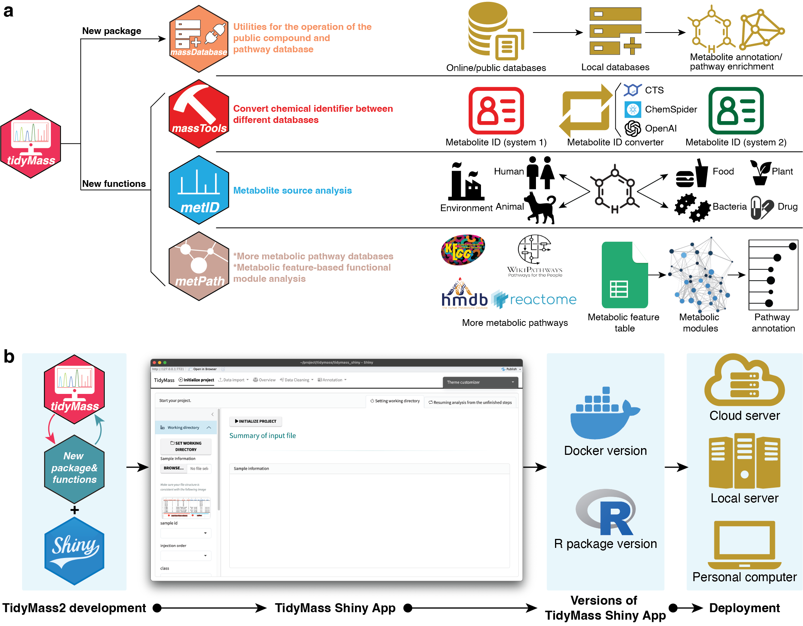

We are very excited to release TidyMass2, a major update to the TidyMass. 

TidyMass2 introduces three major innovations compared TidyMass: 

(1) a comprehensive metabolite origin analysis capability that traces metabolites to human, microbial, 
dietary, pharmaceutical, and environmental sources through integration of 11 metabolite databases containing 
532,488 metabolites with source information; 

(2) a metabolic feature-based functional module analysis approach that bypasses the annotation bottleneck 
by leveraging network topology to extract biological insights from unannotated metabolic features; 

and (3) an intuitive graphical interface that makes advanced metabolomics analyses accessible to researchers without programming expertise. 

When applied to longitudinal urine metabolomics data from human pregnancy, 
TidyMass2 identified metabolites from human, microbiome, and environment, 
and identified 27 dysregulated metabolic modules. It increased the proportion 
of biologically interpretable metabolic features from 5.8% to 58.8%, 
revealing coordinated changes in steroid hormone biosynthesis, 
carbohydrate metabolism, and amino acid processing. 
By expanding biological interpretation beyond conventionally annotated metabolites, 
TidyMass2 enables more comprehensive metabolic phenotyping while maintaining 
open-source principles of reproducibility, traceability, and transparency.

The help documents of TidyMass 2 could be found here: https://www.tidymass.org/docs/
